

  <a href="./README_CN.md">简体中文</a>

  

    

     

 

  <picture>
    <source media="(prefers-color-scheme: dark)" srcset="https://readme-typing-svg.herokuapp.com/?font=Fira+Code&weight=500&size=18&pause=1000&color=A4ABD6&center=true&vCenter=true&width=650&lines=HKUST+Computer+Science+%2B+Chemistry+%7C+CGA+3.999%2F4.3;AI+for+Science+%C2%B7+AI+for+Chemistry+%C2%B7+AutoResearch;Multi-Agent+Systems+%C2%B7+LLM+%C2%B7+Embodied+AI;NeurIPS+%26+ICML+AI4S+Workshop+Reviewer">
    
  </picture>

  <a href="#-featured-work--open-source" title="Explore current research">
    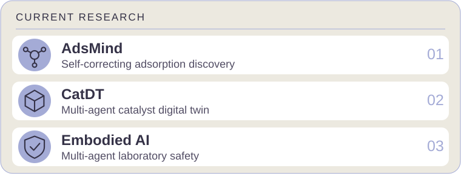
  </a>

<a href="#adsmind">AdsMind</a> · <a href="#catdt">CatDT</a> · <a href="#-research-experience">Laboratory safety</a>

<a href="#research-milestones">Research milestones</a> · <a href="#character-cabinet">Character cabinet</a> · <a href="#developer-easter-egg">Developer vignette</a>

<!-- VISUAL-NAV:START -->

<a href="#-study-notes">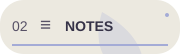</a>

<a href="#-character-cabinet">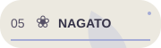</a>

<!-- VISUAL-NAV:END -->

---

<b>📑 Table of Contents (Click to expand)</b>

 

- [👨‍💻 About Me](#%E2%80%8D-about-me)
- [✨ Featured Work & Open Source](#-featured-work--open-source)
- [📄 Publications & Preprints](#-publications--preprints)
- [🔭 Research Experience](#-research-experience)
- [🎓 Education](#-education)
- [💼 Industry & Community Leadership](#-industry--community-leadership)
- [🛠️ Technical Skills](#️-technical-skills)
- [📚 Study Notes](#study-notes)
- [🎮 Geek After Hours](#geek-after-hours)
- [☁️ Community Research Cloud](#community-cloud)
- [📈 GitHub Analytics](#-github-analytics)

---

## 👨‍💻 About Me

I am an undergraduate at **The Hong Kong University of Science and Technology (HKUST)**, majoring in Computer Science with a minor in Chemistry. I was an exchange student at **EPFL, Switzerland** and took virtual coursework at **SJTU**. My research lies at the intersection of **AI and the physical sciences (AI4Science)** — building multi-agent systems that autonomously discover and validate catalytic materials.

As the **Co-Founder & Vice President of the HKUST AI for Chemistry Club**, I am deeply passionate about bridging the gap between computer science algorithms and wet-lab chemical intuition, fostering a community of interdisciplinary innovators.

- 🔬 **Research:** Multi-Agent Systems for autonomous catalyst discovery, LLM-driven scientific workflows, Embodied AI for lab safety.

<b>🏅 Honors, service &amp; languages</b>

- 🏆 **Honors:** HKUST SENG Dean's List ×5 · HKSAR Government Scholarship Fund — Scholarship for Outstanding Performance ×3 · Hong Kong, China-APEC Scholarship ×3.
- 🏅 **Competition Awards:** Finalist Award (Team Category), HKUST GenAI Hackathon Competition on a Putonghua Web Tool · First Prize (Theory Track), 5th National University Students' Data Analysis Popular Science Knowledge Competition Series.
- 📝 **Service:** Reviewer for *MLST (IOP)*, *NeurIPS'26 AI4S Workshop*, *ICML'26 AI4S Workshop*.
- 🌏 **Languages:** Mandarin (native) · English (professional) · Japanese (approximately JLPT N3 level) · French (CEFR A1) · Cantonese (basic).
- ⚡ **Off-duty:** 5 human languages, 7 programming languages, and occasionally building games in Godot & Unity.

- 💬 **Let’s connect:** AI for Science, AI for Chemistry, AutoResearch, and open-source collaboration — [email me](mailto:zzmhkust@gmail.com).

 

<b>⌨️ Research terminal · animated navigation</b>

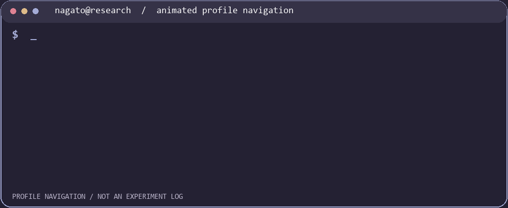

[AdsMind](https://github.com/NagatoBigSeven/AdsMind) · [CatDT](https://github.com/AI4QC/catdt-gs) · [Study notes](#study-notes)

---

<b>🗓️ Recent research updates (click to expand)</b>

<picture><source media="(max-width: 600px)" srcset="./assets/research-milestones-en-mobile.svg" />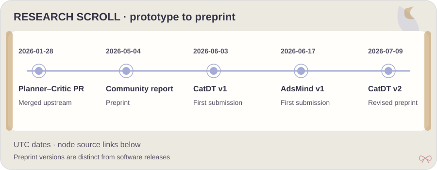</picture>

[2026-01-28 · Merged Planner–Critic PR](https://github.com/schwallergroup/llm_adsorbate/pull/1) · [2026-05-04 · Community report](https://arxiv.org/abs/2605.03205v1) · [2026-06-03 · CatDT v1](https://arxiv.org/abs/2606.05050v1) · [2026-06-17 · AdsMind v1](https://arxiv.org/abs/2606.19152v1) · [2026-07-09 · CatDT v2](https://arxiv.org/abs/2606.05050v2)

**Public code:** [AdsMind](https://github.com/NagatoBigSeven/AdsMind) · [CatDT](https://github.com/AI4QC/catdt-gs)

**Project releases:** [AdsMind](https://github.com/NagatoBigSeven/AdsMind/releases) · [CatDT](https://github.com/AI4QC/catdt-gs/releases)

[📄 All publications](#-publications--preprints) · [🌐 Personal website](https://nagatobigseven.github.io/)

---

## ✨ Featured Work & Open Source

### [AdsMind](https://github.com/NagatoBigSeven/AdsMind) 🚀

<picture><source media="(max-width: 600px)" srcset="./assets/adsmind-showcase-en-mobile.svg" />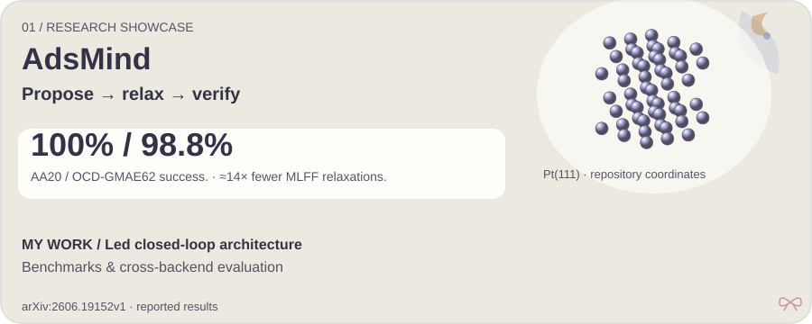</picture>

  
  
  <a href="https://github.com/NagatoBigSeven/AdsMind/blob/main/docs/quickstart.md" title="Quick start">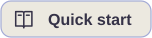</a>

  

<b>🎞️ Animated research loop · workflow schematic · click to toggle</b>

<picture><source media="(prefers-reduced-motion: reduce) and (max-width: 600px)" srcset="./assets/adsmind-story-en-mobile.svg" /><source media="(prefers-reduced-motion: reduce)" srcset="./assets/adsmind-story-en.svg" /><source media="(max-width: 600px)" srcset="./assets/adsmind-loop-en-mobile.gif" />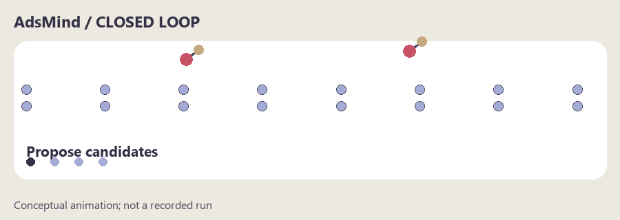</picture>

A conceptual loop illustration; it does not depict a recorded run or measured timing.

Finding stable adsorption configurations on heterogeneous catalyst surfaces has long been a laborious trial-and-error process. **AdsMind** automates this with a multi-agent closed loop: LLM agents propose candidate structures, a machine-learning force field relaxes them, and a physics-grounded verifier self-corrects errors — autonomous correction within the configured workflow.

  <a href="https://arxiv.org/abs/2606.19152v1"><picture><source media="(max-width: 600px)" srcset="./assets/adsmind-story-en-mobile.svg" />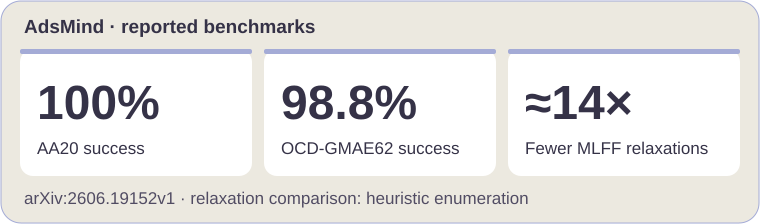</picture></a>

[Reported preprint results and benchmark scope](https://arxiv.org/abs/2606.19152v1).

**My contribution:** Led the closed-loop architecture development, built the benchmark framework, and conducted cross-backend evaluation. [Code history](https://github.com/NagatoBigSeven/AdsMind/commits/main/?author=NagatoBigSeven).

**Try it:** Start with the supplied catalyst slabs and an adsorbate SMILES; inspect the [run report, structure files, and rendered configuration (when available)](https://github.com/NagatoBigSeven/AdsMind/blob/main/docs/quickstart.md#outputs).

### [CatDT](https://github.com/AI4QC/catdt-gs) 🧪

<picture><source media="(max-width: 600px)" srcset="./assets/catdt-showcase-en-mobile.svg" />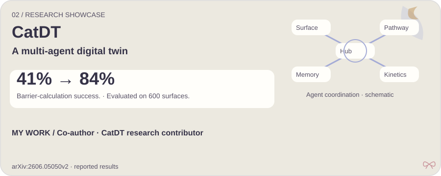</picture>

  
  
  

  

A self-evolving multi-agent digital twin for autonomous heterogeneous catalyst discovery, coordinating surface reconstruction, reaction-pathway analysis, and microkinetics from a bulk crystal and a natural-language reaction description.

  <a href="https://arxiv.org/abs/2606.05050v2"><picture><source media="(max-width: 600px)" srcset="./assets/catdt-story-en-mobile.svg" />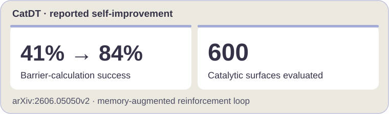</picture></a>

[Reported preprint results and benchmark scope](https://arxiv.org/abs/2606.05050v2).

**My contribution:** Co-author and research contributor to CatDT — [paper authorship](https://arxiv.org/abs/2606.05050) · [system implementation](https://github.com/AI4QC/catdt-gs#agent-tool-architecture-how-it-actually-works).

### 🤝 Selected Open-Source Contributions

  <a href="https://github.com/schwallergroup/llm_adsorbate/pull/1">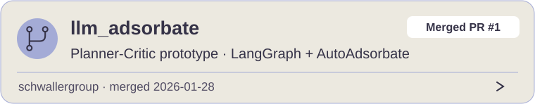</a>

  <a href="https://github.com/NagatoBigSeven/eBPF-LLM-NetSentinel">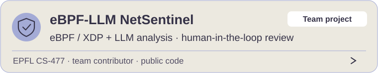</a>

[Merged upstream PR](https://github.com/schwallergroup/llm_adsorbate/pull/1) · [NetSentinel contribution record](https://github.com/NagatoBigSeven/eBPF-LLM-NetSentinel/commit/64a491b5e4995854295fe2058adc8aee980932aa).

---

## 📄 Publications & Preprints

<!-- PAPERS:START -->
| # | Paper | Status |
|:-:|:------|:------|
| 1 | **AdsMind:** A Physics-Grounded Multi-Agent System for Self-Correcting Discovery of Adsorption Configurations on Heterogeneous Catalyst Surfaces | Under review · [arXiv:2606.19152](https://arxiv.org/abs/2606.19152) |
| 2 | **Autonomous heterogeneous catalyst discovery with a self-evolving multi-agent digital twin** | Under review · [arXiv:2606.05050](https://arxiv.org/abs/2606.05050) |
| 3 | **From Knowledge to Action:** Outcomes of the 2025 Large Language Model (LLM) Hackathon for Applications in Materials Science and Chemistry | [arXiv:2605.03205](https://arxiv.org/abs/2605.03205) |
<!-- PAPERS:END -->

<!-- SHOWROOM:START -->

### 🗂️ Research entry points · papers, code & public examples

| Project | Paper | Code | Data / examples | My work |
|:--|:--|:--|:--|:--|
| **AdsMind** | [arXiv](https://arxiv.org/abs/2606.19152) | [GitHub](https://github.com/NagatoBigSeven/AdsMind) | [Public directory](https://github.com/NagatoBigSeven/AdsMind/tree/46f23e230c855c46b57f3dac7b4c2b252d5f45fd/datasets) | [Project overview](#adsmind) |
| **CatDT** | [arXiv](https://arxiv.org/abs/2606.05050) | [GitHub](https://github.com/AI4QC/catdt-gs) | [Public directory](https://github.com/AI4QC/catdt-gs/tree/d231612f42f7f3fe8a7ff4ec5df59b219ef0e8d9/deps/AdsorbDiff/output) | [Project overview](#catdt) |
| **From Knowledge to Action** | [arXiv](https://arxiv.org/abs/2605.03205) | — | — | [Paper authors](https://arxiv.org/abs/2605.03205) |

<b>🔬 Public repository examples · click to open</b>

AdsMind: a projection of 54 committed Pt coordinates, showing a public input structure rather than a new optimization result. [Source](https://github.com/NagatoBigSeven/AdsMind/blob/46f23e230c855c46b57f3dac7b4c2b252d5f45fd/datasets/cmu20/09_Pt_111.xyz) · [XYZ](./assets/pt111-example.xyz)

CatDT: committed AdsorbDiff module example images, showing the initial and diffused structures. These are not a new run or an end-to-end validation of CatDT. [Source](https://github.com/AI4QC/catdt-gs/tree/d231612f42f7f3fe8a7ff4ec5df59b219ef0e8d9/deps/AdsorbDiff/output/Cu111_CO)

[💬 Ask a public research question](https://github.com/NagatoBigSeven/NagatoBigSeven/issues/new?template=research-question.yml) · [✉️ Private collaboration](mailto:zzmhkust@gmail.com)
<!-- SHOWROOM:END -->

---

<b>🖼️ Research visual gallery · papers & code</b>

<a href="https://arxiv.org/abs/2606.19152v1"><picture><source media="(max-width: 600px)" srcset="./assets/adsmind-story-en-mobile.svg" /></picture></a>

<a href="https://arxiv.org/abs/2606.05050v2"><picture><source media="(max-width: 600px)" srcset="./assets/catdt-story-en-mobile.svg" /></picture></a>

[AdsMind PDF](https://arxiv.org/pdf/2606.19152) · [Code](https://github.com/NagatoBigSeven/AdsMind) · [CatDT PDF](https://arxiv.org/pdf/2606.05050) · [Code](https://github.com/AI4QC/catdt-gs)

Visual summaries of existing preprints; these are not conference posters or published book covers. Public talks, models and posters can be added when available.

## 🔭 Research Experience

<b>Final Year Project — HKUST (2026 – 2027 expected)</b>

> **Embodied Multi-Agent System for High-Stakes Environment Safety**
> Advisors: Prof. Chaojian Li & Prof. Lixue Cheng
>
> The project aims to transfer autonomous driving architectures to edge-deployed labs, combining multi-agent reasoning, multimodal sensor fusion, and hardware-in-the-loop (HIL) control for laboratory safety.

<b>UGRA — AI4PhysSci Lab, HKUST (02/2026 – present)</b>

> Supervisor: Prof. Lixue Cheng
>
> - Led the development of **AdsMind**: closed-loop architecture integrating generative agent proposals with machine-learning force-field (MLFF) relaxation feedback and self-correction, with DFT validation on representative systems.
> - Built a systematic multi-agent benchmark for adsorption structure prediction across diverse catalyst surfaces.
> - Contributed to **[CatDT](https://github.com/AI4QC/catdt-gs)**: self-evolving multi-agent digital-twin framework for autonomous heterogeneous catalyst discovery.

<b>Project Student — LIAC, ISIC, EPFL (09/2025 – 01/2026)</b>

> Supervisors: Prof. Philippe Schwaller & Dr. Edvin Fako
>
> Developed agentic simulation methods combining language-model reasoning with atomistic simulation backends. This semester project established the EPFL–HKUST collaboration that produced AdsMind.

<b>UROP — HKUST, Prof. Xiaojuan Ma (02 – 05/2025)</b>

> User Experience & Visual Representation in Virtual Reality

<b>UROP — HKUST, Prof. Raymond Chi-Wing Wong (06 – 12/2024)</b>

> Knowledge Discovery Over Database

---

## 🎓 Education

| Institution | Program | Period |
|:------------|:--------|:-------|
| **HKUST** | BEng Computer Science · Minor in Chemistry · CGA 3.999/4.3 | 09/2023 – present |
| **EPFL**, Switzerland | Exchange, School of Computer and Communication Science | 09/2025 – 02/2026 |
| **SJTU** (APRU Virtual) | MSE2602 Materials Chemistry | 02 – 06/2025 |

---

## 💼 Industry & Community Leadership

| Role | Organization | Period |
|:-----|:-------------|:-------|
| Computer Vision Algorithm Intern | Sansen Well (Shanghai) Robotics Co., Ltd. | 06 – 08/2025 |
| UGTA: COMP2011, CSE Programming Commons | HKUST | 2024 – 2026 |
| **Co-Founder & Vice President** | **HKUST AI for Chemistry Club** | **09/2026 – present** |
| Student Representative, SENG Mainland UG Recruitment | HKUST, Guangzhou | 06 – 07/2026 |

---

## 🛠️ Technical Skills

**In use:** Python · PyTorch · NumPy · LangChain / LangGraph · RDKit / ASE.

**Exploring:** Fine-tuning · Embodied AI · Laboratory safety.

<table>
<tr>
<th width="50%">Research workflows</th>
<th width="50%">Development & other experience</th>
</tr>
<tr>
<td valign="top" width="50%">

<b>AI / ML / LLM</b>

  
  
  
  
  
  
  

<b>Scientific Computing</b>

  
  
  

</td>
<td valign="top" width="50%">

<b>Languages, vision & platforms · click to toggle</b>

<b>Languages</b>

  
  
  
  
  
  
  

<b>Computer Vision & 3D</b>

  
  
  
  

<b>Tools & Platforms</b>

  
  
  
  
  

</td>
</tr>
</table>

---

## 🧭 Open Source Shelf & Activity

<b>Public starred repositories</b>

<b>Public pull requests and stable releases</b>

[🤝 Browse bookmarks, activity and repository contributors](https://github.com/NagatoBigSeven/NagatoBigSeven/blob/profile-live/collection.md)

Bookmarks are grouped by repository language. Contributor attribution comes from public commits and does not imply paper authorship or endorsement. Activity covers the latest 100 public events.

## 📚 Study Notes

<a href="https://github.com/NagatoBigSeven/NagatoBigSeven/blob/profile-live/notes.md"><picture><source media="(max-width: 600px)" srcset="https://raw.githubusercontent.com/NagatoBigSeven/NagatoBigSeven/profile-live/notes-en-mobile.svg" /></picture></a>

[📖 Open the latest notes · direct file links](https://github.com/NagatoBigSeven/NagatoBigSeven/blob/profile-live/notes.md)

| Course & theory notes | Hands-on tool notes |
|:--|:--|
| [GenAI · Hung-yi Lee](https://github.com/NagatoBigSeven/Nagato-no-GenAI-Notes) | [RDKit](https://github.com/NagatoBigSeven/Nagato-no-RDKit-Notes) |
| [NLP](https://github.com/NagatoBigSeven/Nagato-no-NLP-Notes) | [Fine-tuning](https://github.com/NagatoBigSeven/Nagato-no-Fine-Tuning-Notes) |
| [Quantum Information](https://github.com/NagatoBigSeven/Nagato-no-Quantum-Information-Notes) | Chinese-language personal study notes; see each repository for setup. |

---

<!-- BLOG-BOOKSHELF:START -->

### 📖 Chemistry blog bookshelf

- [元素周期律 + 元素周期表](https://www.cnblogs.com/luotei/p/15219152.html) · 2021-09-02
- [酸碱理论](https://www.cnblogs.com/luotei/p/15214931.html) · 2021-09-01
- [氮族元素——磷](https://www.cnblogs.com/luotei/p/15193597.html) · 2021-08-28

Selected Chinese study notes from 2021; the decorative covers are original artwork, not article thumbnails.

[Browse the blog archive](https://www.cnblogs.com/luotei)
<!-- BLOG-BOOKSHELF:END -->

## 🎮 Geek After Hours

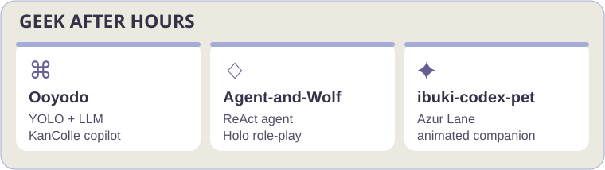

[Ooyodo](https://github.com/NagatoBigSeven/Ooyodo) · [Agent-and-Wolf](https://github.com/NagatoBigSeven/Agent-and-Wolf) · [Ibuki pet](https://github.com/NagatoBigSeven/ibuki-codex-pet)

### 🌸 Character cabinet

<b>🌸 Character cabinet · click to open</b>

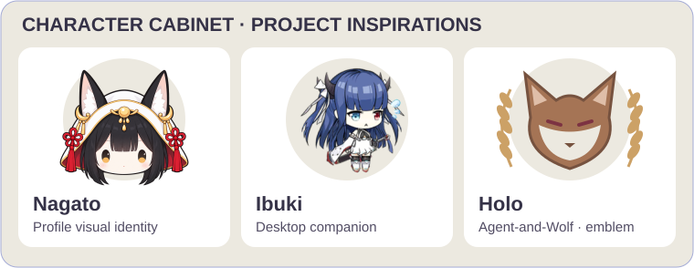

[Nagato](./assets/nagato-floating.svg) · [Ibuki](https://github.com/NagatoBigSeven/ibuki-codex-pet) · [Holo](https://github.com/NagatoBigSeven/Agent-and-Wolf)

Nagato uses the approved icon; Ibuki uses a frame from the project spritesheet; Holo is represented by a wolf-and-wheat emblem.

| Character | Original work | Connection here |
|:--|:--|:--|
| Nagato | Azur Lane | GitHub avatar and profile visual identity |
| Ibuki | Azur Lane | [Animated desktop companion](https://github.com/NagatoBigSeven/ibuki-codex-pet) |
| Holo | Spice and Wolf | [ReAct role-playing agent](https://github.com/NagatoBigSeven/Agent-and-Wolf) |

---

## ☁️ Community Research Cloud

[✏️ Add a topic](https://github.com/NagatoBigSeven/NagatoBigSeven/issues/new?template=research-word.yml) · [🔀 Shuffle](https://github.com/NagatoBigSeven/NagatoBigSeven/issues/new?template=shuffle-cloud.yml) · [🤖 Update status](https://github.com/NagatoBigSeven/NagatoBigSeven/actions/workflows/profile_live.yml)

Sign in to submit a short scientific topic. Your newest valid submission replaces earlier ones; close it to withdraw, or reopen it to vote again. Updates run after submissions; GitHub image caching may delay display.

<b>🖼️ Quarterly cloud gallery · click to open</b>

Each quarter retains its latest real-vote snapshot; example words are excluded. Closing all current votes clears this quarter’s snapshot. Older snapshots show historical counts.

[View full-size snapshots](https://github.com/NagatoBigSeven/NagatoBigSeven/blob/profile-live/history.md)

---

## 📈 GitHub Analytics

[Repositories](https://github.com/NagatoBigSeven?tab=repositories) · [Followers](https://github.com/NagatoBigSeven?tab=followers) · [Update status](https://github.com/NagatoBigSeven/NagatoBigSeven/actions/workflows/profile_live.yml)

  
  

 

  

<b>⌛ Weekly coding activity · public data</b>

Only public WakaTime records are used. Until connected, no hours are shown; the language chart above describes repository contents.

---

<!-- QUOTE:START -->
> “It's the little things done consistently over time, straight from your heart, that have the greatest impact.”  
> —— *Unknown*
<!-- QUOTE:END -->

---

<b>☕ Weekly easter egg</b>

<picture><source media="(max-width: 600px)" srcset="./assets/developer-vignette-en-mobile.svg" />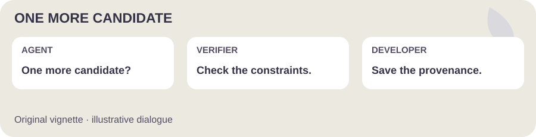</picture>

  
   
  <a href="https://raw.githubusercontent.com/NagatoBigSeven/NagatoBigSeven/main/assets/nagato-banner.png">🔍 View full-size artwork</a>

  

