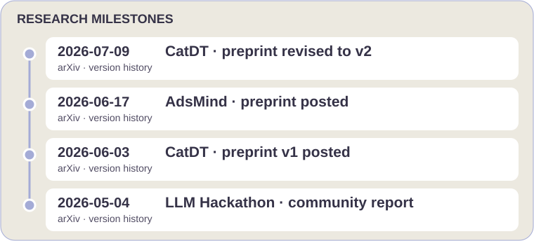

  <a href="./README_CN.md">简体中文</a>

  

    

     

 

  <picture>
    <source media="(prefers-color-scheme: dark)" srcset="https://readme-typing-svg.herokuapp.com/?font=Fira+Code&weight=500&size=18&pause=1000&color=A4ABD6&center=true&vCenter=true&width=650&lines=HKUST+Computer+Science+%2B+Chemistry+%7C+CGA+3.999%2F4.3;AI+for+Science+%C2%B7+AI+for+Chemistry+%C2%B7+AutoResearch;Multi-Agent+Systems+%C2%B7+LLM+%C2%B7+Embodied+AI;NeurIPS+%26+ICML+AI4S+Workshop+Reviewer">
    
  </picture>

  

<a href="#adsmind-">AdsMind</a> · <a href="#catdt-">CatDT</a> · <a href="#-research-experience">Laboratory safety</a>

---

<b>📑 Table of Contents (Click to expand)</b>

 

- [👨‍💻 About Me](#%E2%80%8D-about-me)
- [✨ Featured Work & Open Source](#-featured-work--open-source)
- [📄 Publications & Preprints](#-publications--preprints)
- [🔭 Research Experience](#-research-experience)
- [🎓 Education](#-education)
- [💼 Industry & Community Leadership](#-industry--community-leadership)
- [🛠️ Technical Skills](#️-technical-skills)
- [📈 GitHub Analytics](#-github-analytics)

---

## 👨‍💻 About Me

I am an undergraduate at **The Hong Kong University of Science and Technology (HKUST)**, majoring in Computer Science with a minor in Chemistry. I was an exchange student at **EPFL, Switzerland** and took virtual coursework at **SJTU**. My research lies at the intersection of **AI and the physical sciences (AI4Science)** — building multi-agent systems that autonomously discover and validate catalytic materials.

As the **Founding Organizer of the HKUST AI for Chemistry Club**, I am deeply passionate about bridging the gap between computer science algorithms and wet-lab chemical intuition, fostering a community of interdisciplinary innovators.

- 🔬 **Research:** Multi-Agent Systems for autonomous catalyst discovery, LLM-driven scientific workflows, Embodied AI for lab safety.
- 🏆 **Honors:** Dean's List ×4 · HKSAR Government Scholarship ×2 · HK-APEC Scholarship · Finalist, HKUST GenAI Hackathon · First Prize, 5th National Data Analysis Competition.
- 📝 **Service:** Reviewer for *MLST (IOP)*, *NeurIPS'26 AI4S Workshop*, *ICML'26 AI4S Workshop*.
- 🌏 **Languages:** Mandarin (native) · English (professional) · Japanese (JLPT N3) · French (CEFR A1) · Cantonese (basic).
- ⚡ **Off-duty:** 5 human languages, 7 programming languages, and occasionally building games in Godot & Unity.
- 💬 **Let’s connect:** AI for Science, AI for Chemistry, AutoResearch, and open-source collaboration — [email me](mailto:zzmhkust@gmail.com).

 

---

<b>🗓️ Recent research updates (click to expand)</b>

[CatDT v2](https://arxiv.org/abs/2606.05050v2) · [AdsMind v1](https://arxiv.org/abs/2606.19152v1) · [CatDT v1](https://arxiv.org/abs/2606.05050v1) · [Community report](https://arxiv.org/abs/2605.03205v1)

[📄 All publications](#-publications--preprints) · [🌐 Personal website](https://nagatobigseven.github.io/)

---

## ✨ Featured Work & Open Source

### [AdsMind](https://github.com/NagatoBigSeven/AdsMind) 🚀

  

<b>🎞️ Animated research loop · workflow schematic · click to toggle</b>

A conceptual loop illustration; it does not depict a recorded run or measured timing.

Finding stable adsorption configurations on heterogeneous catalyst surfaces has long been a laborious trial-and-error process. **AdsMind** automates this with a multi-agent closed loop: LLM agents propose candidate structures, a machine-learning force field relaxes them, and a physics-grounded verifier self-corrects errors — no human in the loop.

  
  
  

  

[Reported preprint results and benchmark scope](https://arxiv.org/abs/2606.19152v1).

**My contribution:** Led the closed-loop architecture development, built the benchmark framework, and conducted cross-backend evaluation. [Code history](https://github.com/NagatoBigSeven/AdsMind/commits/main/?author=NagatoBigSeven).

**Try it:** Start with the supplied catalyst slabs and an adsorbate SMILES; inspect the [run report, structure files, and rendered configuration (when available)](https://github.com/NagatoBigSeven/AdsMind/blob/main/docs/quickstart.md#outputs).

### [CatDT](https://github.com/AI4QC/catdt-gs) 🧪

  

A self-evolving multi-agent digital twin for autonomous heterogeneous catalyst discovery, coordinating surface reconstruction, reaction-pathway analysis, and microkinetics from a bulk crystal and a natural-language reaction description.

  
  
  

  

[Reported preprint results and benchmark scope](https://arxiv.org/abs/2606.05050v2).

**My contribution:** Co-author and research contributor to CatDT — [paper authorship](https://arxiv.org/abs/2606.05050) · [system implementation](https://github.com/AI4QC/catdt-gs#agent-tool-architecture-how-it-actually-works).

### 🤝 Selected Open-Source Contributions

  

  

[Merged upstream PR](https://github.com/schwallergroup/llm_adsorbate/pull/1) · [NetSentinel contribution record](https://github.com/NagatoBigSeven/eBPF-LLM-NetSentinel/commit/64a491b5e4995854295fe2058adc8aee980932aa).

---

## 📄 Publications & Preprints

<!-- PAPERS:START -->
| # | Paper | Status |
|:-:|:------|:-------|
| 1 | **AdsMind:** A Physics-Grounded Multi-Agent System for Self-Correcting Discovery of Adsorption Configurations on Heterogeneous Catalyst Surfaces | Under review · [arXiv:2606.19152](https://arxiv.org/abs/2606.19152) |
| 2 | **Autonomous Heterogeneous Catalyst Discovery** with a Self-Evolving Multi-Agent Digital Twin | Under review · [arXiv:2606.05050](https://arxiv.org/abs/2606.05050) |
| 3 | **From Knowledge to Action:** Outcomes of the 2025 LLM Hackathon for Applications in Materials Science and Chemistry | [arXiv:2605.03205](https://arxiv.org/abs/2605.03205) |
<!-- PAPERS:END -->

---

## 🔭 Research Experience

<b>Final Year Project — HKUST (2026 – 2027 expected)</b>

> **Embodied Multi-Agent System for High-Stakes Environment Safety**
> Advisors: Prof. Chaojian Li & Prof. Lixue Cheng
>
> The project aims to transfer autonomous driving architectures to edge-deployed labs, combining multi-agent reasoning, multimodal sensor fusion, and hardware-in-the-loop (HIL) control for laboratory safety.

<b>UGRA — AI4PhysSci Lab, HKUST (02/2026 – present)</b>

> Supervisor: Prof. Lixue Cheng
>
> - Led the development of **AdsMind**: closed-loop architecture integrating generative agent proposals with machine-learning force-field (MLFF) relaxation feedback and self-correction, with DFT validation on representative systems.
> - Built the first systematic multi-agent benchmark for adsorption structure prediction across diverse catalyst surfaces.
> - Contributed to **[CatDT](https://github.com/AI4QC/catdt-gs)**: self-evolving multi-agent digital-twin framework for autonomous heterogeneous catalyst discovery.

<b>Project Student — LIAC, ISIC, EPFL (09/2025 – 01/2026)</b>

> Supervisors: Prof. Philippe Schwaller & Dr. Edvin Fako
>
> Developed agentic simulation methods combining language-model reasoning with atomistic simulation backends. This semester project established the EPFL–HKUST collaboration that produced AdsMind.

<b>UROP — HKUST, Prof. Xiaojuan Ma (02 – 05/2025)</b>

> User Experience & Visual Representation in Virtual Reality

<b>UROP — HKUST, Prof. Raymond Chi-Wing Wong (06 – 12/2024)</b>

> Knowledge Discovery Over Database

---

## 🎓 Education

| Institution | Program | Period |
|:------------|:--------|:-------|
| **HKUST** | BEng Computer Science · Minor in Chemistry · CGA 3.999/4.3 | 09/2023 – present |
| **EPFL**, Switzerland | Exchange, School of Computer and Communication Science | 09/2025 – 02/2026 |
| **SJTU** (APRU Virtual) | MSE2602 Materials Chemistry | 02 – 06/2025 |

---

## 💼 Industry & Community Leadership

| Role | Organization | Period |
|:-----|:-------------|:-------|
| Computer Vision Algorithm Intern | Sansen Well (Shanghai) Robotics Co., Ltd. | 06 – 08/2025 |
| UGTA: COMP2011, CSE Programming Commons | HKUST | 2024 – 2026 |
| **Founding Organizer** | **HKUST AI for Chemistry Club** | **2026 – present** |
| Student Representative, SENG Mainland UG Recruitment | HKUST, Guangzhou | 06 – 07/2026 |

---

## 🛠️ Technical Skills

<table>
<tr>
<th width="50%">Research workflows</th>
<th width="50%">Development & other experience</th>
</tr>
<tr>
<td valign="top" width="50%">

<b>AI / ML / LLM</b>

  
  
  
  
  
  
  

<b>Scientific Computing</b>

  
  
  

</td>
<td valign="top" width="50%">

<b>Languages, vision & platforms · click to toggle</b>

<b>Languages</b>

  
  
  
  
  
  
  

<b>Computer Vision & 3D</b>

  
  
  
  

<b>Tools & Platforms</b>

  
  
  
  
  

</td>
</tr>
</table>

---

## 📈 GitHub Analytics

  
  

 

  
  <!-- 💡 To enable WakaTime coding stats, create a public WakaTime account, change width above to 48%, uncomment the block below, and replace 'NagatoBigSeven' with your WakaTime username:
  
  -->

---

<!-- QUOTE:START -->
> “探索未知，步履不停。”
<!-- QUOTE:END -->

---

  
   
  <a href="https://raw.githubusercontent.com/NagatoBigSeven/NagatoBigSeven/main/assets/nagato-banner.png">🔍 View full-size artwork</a>

  

