

  <a href="./README.md">English</a>

  

    

     

 

  <picture>
    <source media="(prefers-color-scheme: dark)" srcset="https://readme-typing-svg.herokuapp.com/?font=Fira+Code&weight=500&size=18&pause=1000&color=A4ABD6&center=true&vCenter=true&width=650&lines=香港科技大学+计算机科学%2B化学+%7C+CGA+3.999%2F4.3;AI+for+Science+·+AI+for+Chemistry+·+自动化科研;多智能体系统+·+大语言模型+·+具身智能;NeurIPS+%26+ICML+AI4S+Workshop+审稿人">
    
  </picture>

  <a href="#-代表项目与开源" title="探索当前研究">
    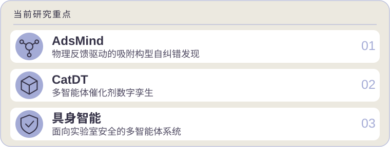
  </a>

<a href="#adsmind">AdsMind</a> · <a href="#catdt">CatDT</a> · <a href="#-科研经历">实验室安全</a>

<a href="#character-cabinet">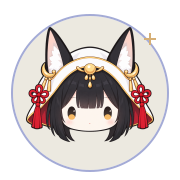</a>

<a href="#research-milestones">科研里程碑</a> · <a href="#character-cabinet">角色柜</a> · <a href="#developer-easter-egg">开发者小剧场</a>

<!-- VISUAL-NAV:START -->

<a href="#-学习笔记">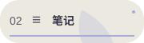</a>

<!-- VISUAL-NAV:END -->

---

<b>📑 目录导航 (点击展开)</b>

 

- [👨‍💻 关于我](#%E2%80%8D-关于我)
- [✨ 代表项目与开源](#-代表项目与开源)
- [📄 论文与预印本](#-论文与预印本)
- [🔭 科研经历](#-科研经历)
- [🎓 教育背景](#-教育背景)
- [💼 行业与社区领导力](#-行业与社区领导力)
- [🛠️ 技术栈](#️-技术栈)
- [📚 学习笔记](#study-notes)
- [🎮 科研之外](#geek-after-hours)
- [☁️ 科学问题互动词云](#community-cloud)
- [📈 GitHub 数据统计](#-github-数据统计)

---

## 👨‍💻 关于我

我是**香港科技大学（HKUST）**计算机科学专业本科生，辅修化学。曾赴**瑞士洛桑联邦理工学院（EPFL）**交换学习，并通过 APRU 虚拟交换修读**上海交通大学（SJTU）**课程。我的研究方向位于 **AI 与自然科学的交叉领域（AI4Science）**——构建能够自主发现和验证催化材料的多智能体系统。

作为 **香港科技大学人工智能化学社的共同创始人兼副主席**，我致力于弥合计算机科学算法与湿实验室化学直觉之间的鸿沟，并培养一个跨学科创新的社区。

- 🔬 **研究方向：** 面向催化剂自主发现的多智能体系统、LLM 驱动的科研工作流、面向实验室安全的具身智能。

<b>🏅 荣誉、学术服务与语言能力</b>

- 🏆 **荣誉：** 香港科技大学工学院院长嘉许名单 ×5 · 香港特别行政区政府卓越表现奖学金 ×3 · 中国香港－亚太经合组织奖学金 ×3。
- 🏅 **竞赛奖项：** 香港科技大学普通话网络工具生成式人工智能黑客松竞赛（普通话学习编程比赛）决赛入围奖（团体组） · 第五届全国大学生数据分析科普竞赛系列活动理论赛一等奖。
- 📝 **学术服务：** *MLST (IOP)*、*NeurIPS'26 AI4S Workshop*、*ICML'26 AI4S Workshop* 审稿人。
- 🌏 **语言能力：** 普通话（母语） · 英语（专业水平，高考 142/150） · 日语（约相当于 JLPT N3 水平） · 法语（CEFR A1） · 粤语（基础）。
- ⚡ **科研之外：** 5 门人类语言，7 门编程语言，偶尔用 Godot 和 Unity 做游戏。

- 💬 **欢迎交流：** AI for Science、AI for Chemistry、自动化科研与开源合作——[邮件联系](mailto:zzmhkust@gmail.com)。

 

<b>⌨️ 科研终端 · 动态导航</b>

[AdsMind](https://github.com/NagatoBigSeven/AdsMind) · [CatDT](https://github.com/AI4QC/catdt-gs) · [Study notes](#study-notes)

---

<b>🗓️ 近期研究动态（点击展开）</b>

<picture><source media="(max-width: 600px)" srcset="./assets/research-milestones-cn-mobile.svg" />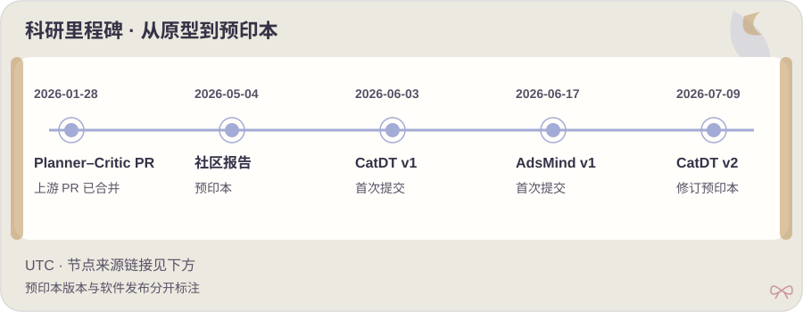</picture>

[2026-01-28 · 上游 Planner–Critic PR](https://github.com/schwallergroup/llm_adsorbate/pull/1) · [2026-05-04 · 社区报告](https://arxiv.org/abs/2605.03205v1) · [2026-06-03 · CatDT v1](https://arxiv.org/abs/2606.05050v1) · [2026-06-17 · AdsMind v1](https://arxiv.org/abs/2606.19152v1) · [2026-07-09 · CatDT v2](https://arxiv.org/abs/2606.05050v2)

**公开代码：** [AdsMind](https://github.com/NagatoBigSeven/AdsMind) · [CatDT](https://github.com/AI4QC/catdt-gs)

**项目发布:** [AdsMind](https://github.com/NagatoBigSeven/AdsMind/releases) · [CatDT](https://github.com/AI4QC/catdt-gs/releases)

[📄 全部论文](#-论文与预印本) · [🌐 个人主页](https://nagatobigseven.github.io/)

---

## ✨ 代表项目与开源

### [AdsMind](https://github.com/NagatoBigSeven/AdsMind) 🚀

<picture><source media="(max-width: 600px)" srcset="./assets/adsmind-showcase-cn-mobile.svg" />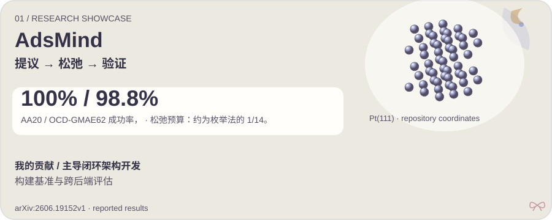</picture>

  
  
  

  <a href="https://github.com/NagatoBigSeven/AdsMind">
    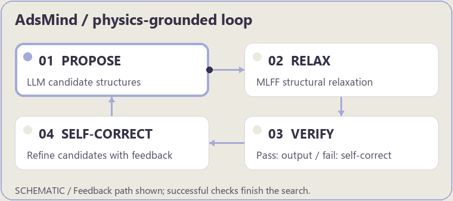
  </a>

<b>🎞️ 动态科研闭环 · 流程示意 · 点击收起或展开</b>

<picture><source media="(prefers-reduced-motion: reduce) and (max-width: 600px)" srcset="./assets/adsmind-story-cn-mobile.svg" /><source media="(prefers-reduced-motion: reduce)" srcset="./assets/adsmind-story-cn.svg" /><source media="(max-width: 600px)" srcset="./assets/adsmind-loop-cn-mobile.gif" />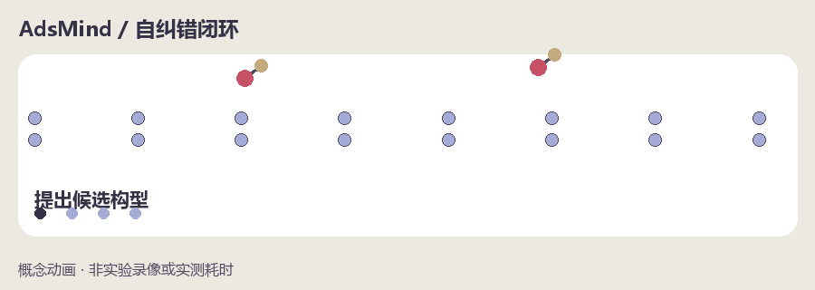</picture>

此动图为概念流程示意，不代表真实运行录像或实测耗时。

在多相催化剂表面寻找稳定的吸附构型一直是一个繁琐的反复试错过程。**AdsMind** 用多智能体闭环系统自动化了这一流程：LLM 智能体提出候选结构、机器学习力场进行松弛、物理验证模块自纠错——在配置好的工作流内自主修正。

  <a href="https://arxiv.org/abs/2606.19152v1"><picture><source media="(max-width: 600px)" srcset="./assets/adsmind-story-cn-mobile.svg" />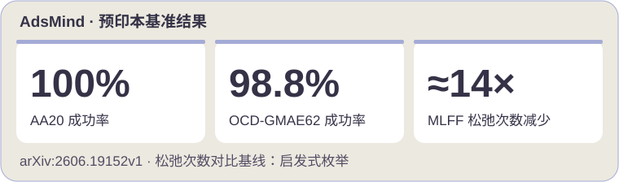</picture></a>

[预印本报告的结果与基准范围](https://arxiv.org/abs/2606.19152v1).

**我的贡献：** 主导闭环架构开发，构建基准测试框架并开展跨后端评估。 [提交记录](https://github.com/NagatoBigSeven/AdsMind/commits/main/?author=NagatoBigSeven)。

**动手体验：** 使用仓库提供的催化剂表面结构和吸附物 SMILES，查看[运行报告、结构文件及渲染成功时生成的构型图](https://github.com/NagatoBigSeven/AdsMind/blob/main/docs/quickstart.md#outputs)。

### [CatDT](https://github.com/AI4QC/catdt-gs) 🧪

<picture><source media="(max-width: 600px)" srcset="./assets/catdt-showcase-cn-mobile.svg" />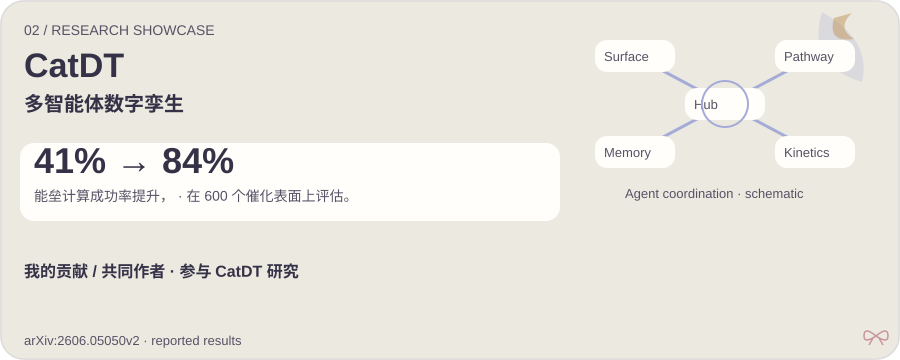</picture>

  
  
  

  <a href="https://github.com/AI4QC/catdt-gs#digital-twin-workflow" title="CatDT architecture and workflow">
    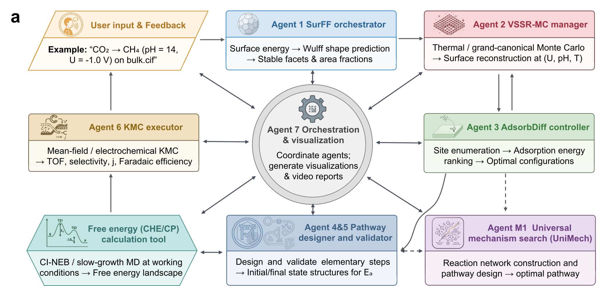
  </a>

面向多相催化剂自主发现的自演化多智能体数字孪生系统：从晶体结构和自然语言反应描述出发，协调表面重构、反应路径分析与微观动力学计算。

  <a href="https://arxiv.org/abs/2606.05050v2"><picture><source media="(max-width: 600px)" srcset="./assets/catdt-story-cn-mobile.svg" />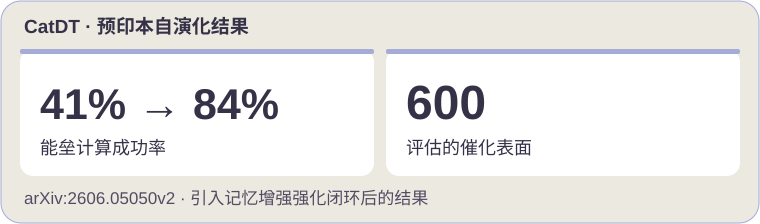</picture></a>

[预印本报告的结果与基准范围](https://arxiv.org/abs/2606.05050v2).

**我的贡献：** 作为共同作者参与 CatDT 研究——[论文署名](https://arxiv.org/abs/2606.05050) · [系统实现](https://github.com/AI4QC/catdt-gs#agent-tool-architecture-how-it-actually-works)。

### 🤝 精选开源贡献

  <a href="https://github.com/schwallergroup/llm_adsorbate/pull/1">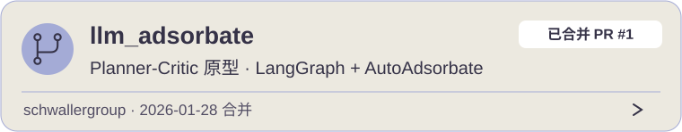</a>

  <a href="https://github.com/NagatoBigSeven/eBPF-LLM-NetSentinel">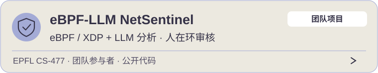</a>

[已合并的上游 PR](https://github.com/schwallergroup/llm_adsorbate/pull/1) · [NetSentinel 提交记录](https://github.com/NagatoBigSeven/eBPF-LLM-NetSentinel/commit/64a491b5e4995854295fe2058adc8aee980932aa)。

---

## 📄 论文与预印本

<!-- PAPERS:START -->
| # | 论文标题 | 状态 |
|:-:|:------|:------|
| 1 | **AdsMind:** A Physics-Grounded Multi-Agent System for Self-Correcting Discovery of Adsorption Configurations on Heterogeneous Catalyst Surfaces | 审稿中 · [arXiv:2606.19152](https://arxiv.org/abs/2606.19152) |
| 2 | **Autonomous Heterogeneous Catalyst Discovery** with a Self-Evolving Multi-Agent Digital Twin | 审稿中 · [arXiv:2606.05050](https://arxiv.org/abs/2606.05050) |
| 3 | **From Knowledge to Action:** Outcomes of the 2025 Large Language Model (LLM) Hackathon for Applications in Materials Science and Chemistry | [arXiv:2605.03205](https://arxiv.org/abs/2605.03205) |
<!-- PAPERS:END -->

<!-- SHOWROOM:START -->

### 🗂️ 成果入口 · 论文、代码与公开样例

| 项目 | 论文 | 代码 | 数据 / 样例 | 我的工作 |
|:--|:--|:--|:--|:--|
| **AdsMind** | [arXiv](https://arxiv.org/abs/2606.19152) | [GitHub](https://github.com/NagatoBigSeven/AdsMind) | [公开目录](https://github.com/NagatoBigSeven/AdsMind/tree/46f23e230c855c46b57f3dac7b4c2b252d5f45fd/datasets) | [项目介绍](#adsmind) |
| **CatDT** | [arXiv](https://arxiv.org/abs/2606.05050) | [GitHub](https://github.com/AI4QC/catdt-gs) | [公开目录](https://github.com/AI4QC/catdt-gs/tree/d231612f42f7f3fe8a7ff4ec5df59b219ef0e8d9/deps/AdsorbDiff/output) | [项目介绍](#catdt) |
| **From Knowledge to Action** | [arXiv](https://arxiv.org/abs/2605.03205) | — | — | [论文署名](https://arxiv.org/abs/2605.03205) |

<b>🔬 公开仓库案例 · 点击展开</b>

<a href="https://github.com/NagatoBigSeven/AdsMind/blob/46f23e230c855c46b57f3dac7b4c2b252d5f45fd/datasets/cmu20/09_Pt_111.xyz">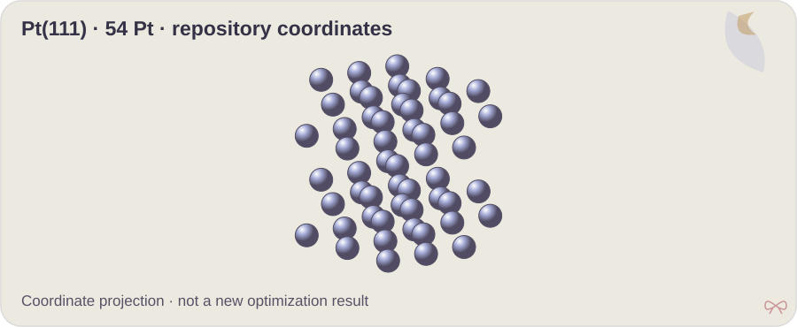</a>

AdsMind：按已提交的 54 个 Pt 原子坐标生成投影，属于公开输入结构展示，不是本轮优化结果。 [Source](https://github.com/NagatoBigSeven/AdsMind/blob/46f23e230c855c46b57f3dac7b4c2b252d5f45fd/datasets/cmu20/09_Pt_111.xyz) · [XYZ](./assets/pt111-example.xyz)

CatDT：以下图片来自仓库中的 AdsorbDiff 模块示例，分别为初始结构与采样后结构；不是本轮运行，也不代表完整 CatDT 端到端验证。 [Source](https://github.com/AI4QC/catdt-gs/tree/d231612f42f7f3fe8a7ff4ec5df59b219ef0e8d9/deps/AdsorbDiff/output/Cu111_CO)

[💬 公开科研交流](https://github.com/NagatoBigSeven/NagatoBigSeven/issues/new?template=research-question.yml) · [✉️ 私密合作联系](mailto:zzmhkust@gmail.com)
<!-- SHOWROOM:END -->

---

<b>🖼️ 研究图解画廊 · 论文与代码</b>

<a href="https://arxiv.org/abs/2606.19152v1"><picture><source media="(max-width: 600px)" srcset="./assets/adsmind-story-cn-mobile.svg" /></picture></a>

<a href="https://arxiv.org/abs/2606.05050v2"><picture><source media="(max-width: 600px)" srcset="./assets/catdt-story-cn-mobile.svg" /></picture></a>

[AdsMind PDF](https://arxiv.org/pdf/2606.19152) · [Code](https://github.com/NagatoBigSeven/AdsMind) · [CatDT PDF](https://arxiv.org/pdf/2606.05050) · [Code](https://github.com/AI4QC/catdt-gs)

图解基于已有预印本；不是会议海报或正式出版封面。公开演讲、模型和海报资料可在确认后加入。

## 🔭 科研经历

<b>本科毕业设计 — 香港科技大学（2026 – 2027，进行中）</b>

> **面向高风险环境安全的具身多智能体系统**
> 导师：[李朝鉴教授](https://seng.hkust.edu.hk/about/people/faculty/chaojian-li) & [程立雪教授](https://chem.hkust.edu.hk/node/961)
>
> 项目旨在将自动驾驶架构迁移至边缘部署的实验室环境，融合多智能体推理、多模态传感器融合与硬件在环（HIL）控制，用于实验室安全保障。

<b>本科生科研助理（UGRA）— AI4PhysSci 实验室，HKUST（02/2026 至今）</b>

> 导师：[程立雪教授](https://chem.hkust.edu.hk/node/961)
>
> - 主导开发 **AdsMind**：设计闭环架构，将生成式智能体提议与机器学习力场（MLFF）松弛反馈及自纠错机制相结合，并使用 DFT 对代表性体系进行验证。
> - 构建了面向吸附结构预测的系统性多智能体基准测试框架，覆盖多种催化剂表面。
> - 参与 **[CatDT](https://github.com/AI4QC/catdt-gs)** 项目：面向多相催化剂自主发现的自演化多智能体数字孪生框架。

<b>项目学生 — LIAC, ISIC, EPFL（09/2025 – 01/2026）</b>

> 导师：Philippe Schwaller 教授 & Edvin Fako 博士
>
> 开发了结合语言模型推理与原子模拟后端的智能体模拟方法。本学期项目促成了 EPFL–HKUST 的科研合作，催生了 AdsMind 系统。

<b>UROP — 香港科技大学，<a href="https://facultyprofiles.hkust.edu.hk/profiles.php?profile=xiaojuan-ma-mxj">麻晓娟教授</a>（02 – 05/2025）</b>

> 虚拟现实中的用户体验与视觉表征研究

<b>UROP — 香港科技大学，<a href="https://researchportal.hkust.edu.hk/en/persons/raymond-chi-wing-wong/">黄智荣教授</a>（06 – 12/2024）</b>

> 数据库知识发现

---

## 🎓 教育背景

| 学校 | 专业/项目 | 时间 |
|:-----|:---------|:-----|
| **香港科技大学** | 工学学士，计算机科学 · 辅修化学 · CGA 3.999/4.3 | 09/2023 至今 |
| **瑞士洛桑联邦理工学院** | 交换生，计算机与通信科学学院 | 09/2025 – 02/2026 |
| **上海交通大学**（APRU 虚拟交换） | MSE2602 材料化学 | 02 – 06/2025 |

---

## 💼 行业与社区领导力

| 职位 | 机构 | 时间 |
|:-----|:-----|:-----|
| 计算机视觉算法实习生 | 三森维尔（上海）机器人科技有限公司 | 06 – 08/2025 |
| 本科教学助理：COMP2011、CSE Programming Commons | 香港科技大学 | 2024 – 2026 |
| **共同创始人兼副主席** | **香港科技大学人工智能化学社** | **09/2026 至今** |
| 学生代表，工学院内地本科招生（广州） | 香港科技大学 | 06 – 07/2026 |

---

## 🛠️ 技术栈

**正在使用：** Python · PyTorch · NumPy · LangChain / LangGraph · RDKit / ASE。

**正在探索：** 微调 · 具身智能 · 实验室安全。

<a href="https://www.python.org/" title="python">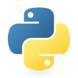</a>
<a href="https://pytorch.org/" title="pytorch">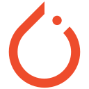</a>
<a href="https://numpy.org/" title="numpy">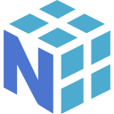</a>

<a href="https://www.rust-lang.org/" title="rust">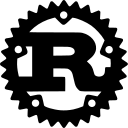</a>

<a href="https://godotengine.org/" title="godot">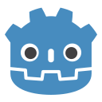</a>
<a href="https://unity.com/" title="unity">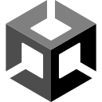</a>

<table>
<tr>
<th width="50%">科研工作流</th>
<th width="50%">开发与其他经验</th>
</tr>
<tr>
<td valign="top" width="50%">

<b>AI / 机器学习 / 大语言模型</b>

  
  
  
  
  
  
  

<b>科学计算</b>

  
  
  

</td>
<td valign="top" width="50%">

<b>编程语言、视觉与开发平台 · 点击收起或展开</b>

<b>编程语言</b>

  
  
  
  
  
  
  

<b>计算机视觉与 3D</b>

  
  
  
  

<b>工具与平台</b>

  
  
  
  
  

</td>
</tr>
</table>

---

## 🧭 开源收藏与动态

<b>公开 Star 收藏</b>

<b>公开 PR 与正式发布</b>

[🤝 查看收藏、动态与真实仓库贡献者](https://github.com/NagatoBigSeven/NagatoBigSeven/blob/profile-live/collection.md)

收藏按仓库主语言归类；贡献者来自公开提交归属，不等同于论文作者或合作背书。动态仅覆盖最近 100 条公开事件。

## 📚 学习笔记

<a href="https://github.com/NagatoBigSeven/NagatoBigSeven/blob/profile-live/notes.md"><picture><source media="(max-width: 600px)" srcset="https://raw.githubusercontent.com/NagatoBigSeven/NagatoBigSeven/profile-live/notes-cn-mobile.svg" /></picture></a>

[📖 打开最新笔记目录 · 文件直达链接](https://github.com/NagatoBigSeven/NagatoBigSeven/blob/profile-live/notes.md)

| 课程与理论笔记 | 动手实践笔记 |
|:--|:--|
| [GenAI · Hung-yi Lee](https://github.com/NagatoBigSeven/Nagato-no-GenAI-Notes) | [RDKit](https://github.com/NagatoBigSeven/Nagato-no-RDKit-Notes) |
| [NLP](https://github.com/NagatoBigSeven/Nagato-no-NLP-Notes) | [Fine-tuning](https://github.com/NagatoBigSeven/Nagato-no-Fine-Tuning-Notes) |
| [Quantum Information](https://github.com/NagatoBigSeven/Nagato-no-Quantum-Information-Notes) | 中文个人学习笔记；使用方法见各仓库。 |

---

<!-- BLOG-BOOKSHELF:START -->

### 📖 化学随笔书架

<a href="https://www.cnblogs.com/luotei/p/15219152.html" title="元素周期律 + 元素周期表">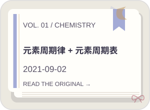</a>
<a href="https://www.cnblogs.com/luotei/p/15214931.html" title="酸碱理论">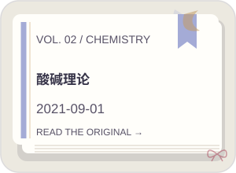</a>
<a href="https://www.cnblogs.com/luotei/p/15193597.html" title="氮族元素——磷">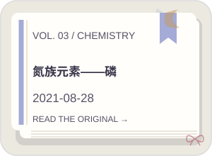</a>

- [元素周期律 + 元素周期表](https://www.cnblogs.com/luotei/p/15219152.html) · 2021-09-02
- [酸碱理论](https://www.cnblogs.com/luotei/p/15214931.html) · 2021-09-01
- [氮族元素——磷](https://www.cnblogs.com/luotei/p/15193597.html) · 2021-08-28

2021 年中文学习随笔选读；封面为原创装饰图，不是原文缩略图。

[浏览博客归档](https://www.cnblogs.com/luotei)
<!-- BLOG-BOOKSHELF:END -->

## 🎮 科研之外

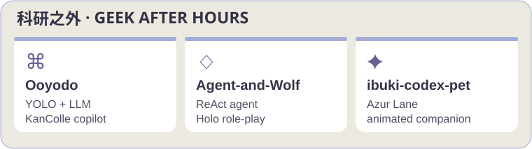

[Ooyodo](https://github.com/NagatoBigSeven/Ooyodo) · [Agent-and-Wolf](https://github.com/NagatoBigSeven/Agent-and-Wolf) · [Ibuki pet](https://github.com/NagatoBigSeven/ibuki-codex-pet)

### 🌸 角色柜

<b>🌸 角色收藏 · 点击展开</b>

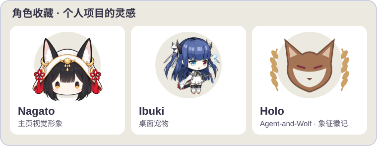

[Nagato](./assets/nagato-floating.svg) · [Ibuki](https://github.com/NagatoBigSeven/ibuki-codex-pet) · [Holo](https://github.com/NagatoBigSeven/Agent-and-Wolf)

长门沿用已认可的 icon；伊吹使用项目原始精灵帧；赫萝以狼耳与麦穗徽记呈现。

| 角色 | 作品出处 | 在这里的关联 |
|:--|:--|:--|
| 长门 | 碧蓝航线 | GitHub 头像与主页视觉形象 |
| 伊吹 | 碧蓝航线 | [动态桌面伙伴](https://github.com/NagatoBigSeven/ibuki-codex-pet) |
| 赫萝 | 狼与香辛料 | [ReAct 角色扮演智能体](https://github.com/NagatoBigSeven/Agent-and-Wolf) |

---

## ☁️ 科学问题互动词云

[✏️ 添加主题](https://github.com/NagatoBigSeven/NagatoBigSeven/issues/new?template=research-word.yml) · [🔀 重新排列](https://github.com/NagatoBigSeven/NagatoBigSeven/issues/new?template=shuffle-cloud.yml) · [🤖 更新状态](https://github.com/NagatoBigSeven/NagatoBigSeven/actions/workflows/profile_live.yml)

登录 GitHub 后提交简短科学主题。每个账号最新的有效投稿替代旧投稿；关闭即可撤回，重新打开可恢复投票。投稿后自动更新，GitHub 图片缓存可能延迟显示。

<b>🖼️ 词云历史画廊 · 点击展开</b>

每季度保留最近一次真实投票快照，示例词不归档。撤回当前全部投票后会清除本季度快照；往期图片展示历史票数。

[查看完整历史快照](https://github.com/NagatoBigSeven/NagatoBigSeven/blob/profile-live/history.md)

---

## 📈 GitHub 数据统计

[公开仓库](https://github.com/NagatoBigSeven?tab=repositories) · [关注者](https://github.com/NagatoBigSeven?tab=followers) · [更新状态](https://github.com/NagatoBigSeven/NagatoBigSeven/actions/workflows/profile_live.yml)

  
  

 

  

<b>⌛ 每周编程活动 · 公开数据</b>

仅使用公开 WakaTime 记录。尚未连接时不显示时长；上方语言图表示仓库内容占比。

---

<!-- QUOTE:START -->
> “探索未知，步履不停。”
<!-- QUOTE:END -->

---

<b>☕ 周间彩蛋</b>

<picture><source media="(max-width: 600px)" srcset="./assets/developer-vignette-cn-mobile.svg" />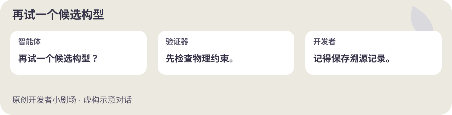</picture>

  <a href="https://raw.githubusercontent.com/NagatoBigSeven/NagatoBigSeven/main/assets/nagato-banner.png" title="点击查看原图">
    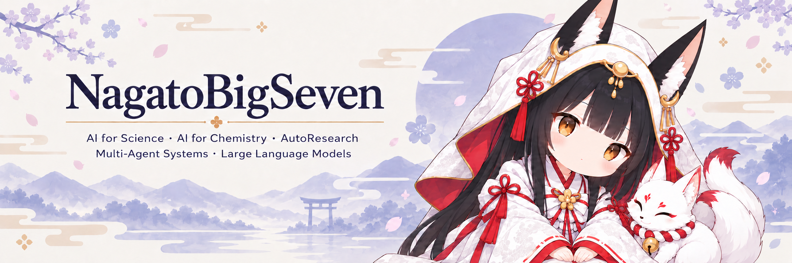
  </a>
   
  <a href="https://raw.githubusercontent.com/NagatoBigSeven/NagatoBigSeven/main/assets/nagato-banner.png">🔍 查看高清原图</a>

  

