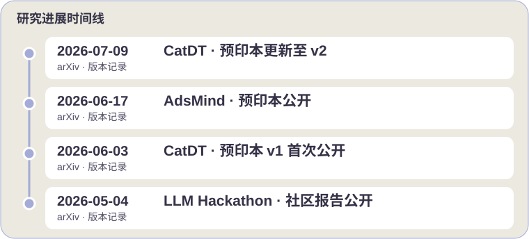

  <a href="./README.md">English</a>

  

    

     

 

  <picture>
    <source media="(prefers-color-scheme: dark)" srcset="https://readme-typing-svg.herokuapp.com/?font=Fira+Code&weight=500&size=18&pause=1000&color=A4ABD6&center=true&vCenter=true&width=650&lines=香港科技大学+计算机科学%2B化学+%7C+CGA+3.999%2F4.3;AI+for+Science+·+AI+for+Chemistry+·+自动化科研;多智能体系统+·+大语言模型+·+具身智能;NeurIPS+%26+ICML+AI4S+Workshop+审稿人">
    
  </picture>

  

<a href="#adsmind-">AdsMind</a> · <a href="#catdt-">CatDT</a> · <a href="#-科研经历">实验室安全</a>

---

<b>📑 目录导航 (点击展开)</b>

 

- [👨‍💻 关于我](#%E2%80%8D-关于我)
- [✨ 代表项目与开源](#-代表项目与开源)
- [📄 论文与预印本](#-论文与预印本)
- [🔭 科研经历](#-科研经历)
- [🎓 教育背景](#-教育背景)
- [💼 行业与社区领导力](#-行业与社区领导力)
- [🛠️ 技术栈](#️-技术栈)
- [📈 GitHub 数据统计](#-github-数据统计)

---

## 👨‍💻 关于我

我是**香港科技大学（HKUST）**计算机科学专业本科生，辅修化学。曾赴**瑞士洛桑联邦理工学院（EPFL）**交换学习，并通过 APRU 虚拟交换修读**上海交通大学（SJTU）**课程。我的研究方向位于 **AI 与自然科学的交叉领域（AI4Science）**——构建能够自主发现和验证催化材料的多智能体系统。

作为 **HKUST AI for Chemistry Club 的创始组织者**，我致力于弥合计算机科学算法与湿实验室化学直觉之间的鸿沟，并培养一个跨学科创新的社区。

- 🔬 **研究方向：** 面向催化剂自主发现的多智能体系统、LLM 驱动的科研工作流、面向实验室安全的具身智能。
- 🏆 **荣誉：** Dean's List ×4 · 香港特区政府奖学金 ×2 · 中国香港-APEC 奖学金 · HKUST GenAI Hackathon 决赛入围 · 全国数据分析大赛一等奖。
- 📝 **学术服务：** *MLST (IOP)*、*NeurIPS'26 AI4S Workshop*、*ICML'26 AI4S Workshop* 审稿人。
- 🌏 **语言能力：** 普通话（母语） · 英语（专业水平，高考 142/150） · 日语（JLPT N3） · 法语（CEFR A1） · 粤语（基础）。
- ⚡ **科研之外：** 5 门人类语言，7 门编程语言，偶尔用 Godot 和 Unity 做游戏。
- 💬 **欢迎交流：** AI for Science、AI for Chemistry、自动化科研与开源合作——[邮件联系](mailto:zzmhkust@gmail.com)。

 

---

<b>🗓️ 近期研究动态（点击展开）</b>

[CatDT v2](https://arxiv.org/abs/2606.05050v2) · [AdsMind v1](https://arxiv.org/abs/2606.19152v1) · [CatDT v1](https://arxiv.org/abs/2606.05050v1) · [社区报告](https://arxiv.org/abs/2605.03205v1)

[📄 全部论文](#-论文与预印本) · [🌐 个人主页](https://nagatobigseven.github.io/)

---

## ✨ 代表项目与开源

### [AdsMind](https://github.com/NagatoBigSeven/AdsMind) 🚀

  

<b>🎞️ 动态科研闭环 · 流程示意 · 点击收起或展开</b>

此动图为概念流程示意，不代表真实运行录像或实测耗时。

在多相催化剂表面寻找稳定的吸附构型一直是一个繁琐的反复试错过程。**AdsMind** 用多智能体闭环系统自动化了这一流程：LLM 智能体提出候选结构、机器学习力场进行松弛、物理验证模块自纠错——全程无需人工干预。

  
  
  

  

[预印本报告的结果与基准范围](https://arxiv.org/abs/2606.19152v1).

**我的贡献：** 主导闭环架构开发，构建基准测试框架并开展跨后端评估。 [提交记录](https://github.com/NagatoBigSeven/AdsMind/commits/main/?author=NagatoBigSeven)。

**动手体验：** 使用仓库提供的催化剂表面结构和吸附物 SMILES，查看[运行报告、结构文件及渲染成功时生成的构型图](https://github.com/NagatoBigSeven/AdsMind/blob/main/docs/quickstart.md#outputs)。

### [CatDT](https://github.com/AI4QC/catdt-gs) 🧪

  

面向多相催化剂自主发现的自演化多智能体数字孪生系统：从晶体结构和自然语言反应描述出发，协调表面重构、反应路径分析与微观动力学计算。

  
  
  

  

[预印本报告的结果与基准范围](https://arxiv.org/abs/2606.05050v2).

**我的贡献：** 作为共同作者参与 CatDT 研究——[论文署名](https://arxiv.org/abs/2606.05050) · [系统实现](https://github.com/AI4QC/catdt-gs#agent-tool-architecture-how-it-actually-works)。

### 🤝 精选开源贡献

  

  

[已合并的上游 PR](https://github.com/schwallergroup/llm_adsorbate/pull/1) · [NetSentinel 提交记录](https://github.com/NagatoBigSeven/eBPF-LLM-NetSentinel/commit/64a491b5e4995854295fe2058adc8aee980932aa)。

---

## 📄 论文与预印本

<!-- PAPERS:START -->
| # | 论文标题 | 状态 |
|:-:|:------|:------|
| 1 | **AdsMind:** A Physics-Grounded Multi-Agent System for Self-Correcting Discovery of Adsorption Configurations on Heterogeneous Catalyst Surfaces | 审稿中 · [arXiv:2606.19152](https://arxiv.org/abs/2606.19152) |
| 2 | **Autonomous Heterogeneous Catalyst Discovery** with a Self-Evolving Multi-Agent Digital Twin | 审稿中 · [arXiv:2606.05050](https://arxiv.org/abs/2606.05050) |
| 3 | **From Knowledge to Action:** Outcomes of the 2025 LLM Hackathon for Applications in Materials Science and Chemistry | [arXiv:2605.03205](https://arxiv.org/abs/2605.03205) |
<!-- PAPERS:END -->

---

## 🔭 科研经历

<b>本科毕业设计 — 香港科技大学（2026 – 2027，进行中）</b>

> **面向高风险环境安全的具身多智能体系统**
> 导师：李超建教授 & 程力雪教授
>
> 项目旨在将自动驾驶架构迁移至边缘部署的实验室环境，融合多智能体推理、多模态传感器融合与硬件在环（HIL）控制，用于实验室安全保障。

<b>本科生科研助理（UGRA）— AI4PhysSci 实验室，HKUST（02/2026 至今）</b>

> 导师：程力雪教授
>
> - 主导开发 **AdsMind**：设计闭环架构，将生成式智能体提议与机器学习力场（MLFF）松弛反馈及自纠错机制相结合，并使用 DFT 对代表性体系进行验证。
> - 构建了首个面向吸附结构预测的系统性多智能体基准测试框架，覆盖多种催化剂表面。
> - 参与 **[CatDT](https://github.com/AI4QC/catdt-gs)** 项目：面向多相催化剂自主发现的自演化多智能体数字孪生框架。

<b>项目学生 — LIAC, ISIC, EPFL（09/2025 – 01/2026）</b>

> 导师：Philippe Schwaller 教授 & Edvin Fako 博士
>
> 开发了结合语言模型推理与原子模拟后端的智能体模拟方法。本学期项目促成了 EPFL–HKUST 的科研合作，催生了 AdsMind 系统。

<b>UROP — 香港科技大学，马小娟教授（02 – 05/2025）</b>

> 虚拟现实中的用户体验与视觉表征研究

<b>UROP — 香港科技大学，黄志伟教授（06 – 12/2024）</b>

> 数据库知识发现

---

## 🎓 教育背景

| 学校 | 专业/项目 | 时间 |
|:-----|:---------|:-----|
| **香港科技大学** | 工学学士，计算机科学 · 辅修化学 · CGA 3.999/4.3 | 09/2023 至今 |
| **瑞士洛桑联邦理工学院** | 交换生，计算机与通信科学学院 | 09/2025 – 02/2026 |
| **上海交通大学**（APRU 虚拟交换） | MSE2602 材料化学 | 02 – 06/2025 |

---

## 💼 行业与社区领导力

| 职位 | 机构 | 时间 |
|:-----|:-----|:-----|
| 计算机视觉算法实习生 | 三森维尔（上海）机器人科技有限公司 | 06 – 08/2025 |
| 本科教学助理：COMP2011、CSE Programming Commons | 香港科技大学 | 2024 – 2026 |
| **创始组织者** | **HKUST AI for Chemistry Club** | **2026 至今** |
| 学生代表，工学院内地本科招生（广州） | 香港科技大学 | 06 – 07/2026 |

---

## 🛠️ 技术栈

<table>
<tr>
<th width="50%">科研工作流</th>
<th width="50%">开发与其他经验</th>
</tr>
<tr>
<td valign="top" width="50%">

<b>AI / 机器学习 / 大语言模型</b>

  
  
  
  
  
  
  

<b>科学计算</b>

  
  
  

</td>
<td valign="top" width="50%">

<b>编程语言、视觉与开发平台 · 点击收起或展开</b>

<b>编程语言</b>

  
  
  
  
  
  
  

<b>计算机视觉与 3D</b>

  
  
  
  

<b>工具与平台</b>

  
  
  
  
  

</td>
</tr>
</table>

---

## 📈 GitHub 数据统计

  
  

 

  
  <!-- 💡 如果想启用 WakaTime 编程时长统计，请先注册 WakaTime 公开账号，将上方 width 改回 48%，取消下方注释，并将用户名改为你的真实 WakaTime ID:
  
  -->

---

<!-- QUOTE:START -->
> “探索未知，步履不停。”
<!-- QUOTE:END -->

---

  
   
  <a href="https://raw.githubusercontent.com/NagatoBigSeven/NagatoBigSeven/main/assets/nagato-banner.png">🔍 查看高清原图</a>

  

